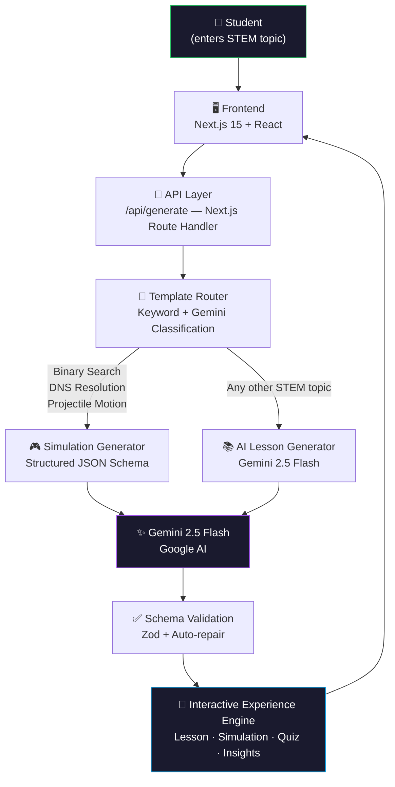

<div align="center">

# 🚀 STEMCraft AI


### **Transform Any STEM Topic into an Interactive Learning Experience**

*Built for **DSH Hacks V1** · Theme: AI × STEM Education*

[🌐 Live Demo](#getting-started) · [🎯 Features](#-features) · [🏗️ Architecture](#-architecture) · [🚀 Getting Started](#-getting-started)

---

</div>

## 🧩 Problem

Traditional STEM education relies on methods that don't scale to individual learners:

| ❌ Traditional Learning | ✅ STEMCraft AI |
|---|---|
| Static PDFs & textbooks | AI-generated interactive lessons |
| Long, passive video lectures | Live visual simulations |
| One-size-fits-all curriculum | Personalized learning path |
| No real-time feedback | Adaptive quizzes with instant insights |

> Students struggle to **visualize**, **interact with**, and truly **understand** complex STEM concepts through passive content alone. Engagement drops. Retention suffers.

---

## 💡 Solution

**STEMCraft AI** leverages **Google Gemini 2.5 Flash** to instantly transform any STEM topic into a complete, interactive learning experience — no preparation, no waiting.

Type a topic. Get a full lesson in seconds.

```
"Kubernetes"          →  Structured explanation + key concepts + quiz
"Binary Search"       →  Step-through visual simulation + adaptive quiz
"DNS Resolution"      →  Animated resolution trace + personalized insights
"Projectile Motion"   →  Physics simulation + quiz + learning tips
```

---

## ✨ Features

### 📚 AI Lesson Generation
Gemini 2.5 Flash generates structured, curriculum-quality explanations for **any** STEM topic — from cloud computing to quantum mechanics. Includes hook, key ideas, analogies, and concept cards.

### 🎮 Interactive Simulations
For supported topics, STEMCraft renders **live, step-through visual simulations**:
- **Binary Search** — trace through a sorted array in real time
- **DNS Resolution** — animate the full browser → resolver → root → TLD → authoritative → response flow
- **Projectile Motion** — adjust angle and velocity to visualize trajectories

### 🧠 Adaptive Quizzes
AI-generated multiple-choice questions that test genuine understanding — not rote memorization. Each question includes a detailed explanation of the correct answer.

### 📈 Personalized Learning Insights
After every session, STEMCraft surfaces **AI-generated learning tips** tailored to the topic — highlighting what to explore next and common misconceptions to watch for.

### ⚡ Gemini-Powered Real-Time Generation
All content is generated **on demand** using Gemini 2.5 Flash with structured JSON schemas — ensuring consistent, valid, and high-quality output every time.

---

## 🏗️ Architecture



### Request Flow

```
User Input → Template Resolution → Gemini Generation → Zod Validation → Experience Render
               ↓                                          ↓
          Keyword Match                           Schema Repair (retry)
          Gemini Classify                         Partial Acceptance
          Default: ai_lesson                      Static Fallback
```

---

## 🛠️ Tech Stack

<table>
<tr>
<td valign="top" width="33%">

### Frontend
- **Next.js 15** — App Router, Server Components
- **React 19** — Hooks, Suspense
- **TypeScript 5** — Strict type safety
- **Tailwind CSS** — Utility-first styling
- **Framer Motion** — Smooth animations
- **Lucide React** — Icon system

</td>
<td valign="top" width="33%">

### AI & Backend
- **Google Gemini 2.5 Flash** — Lesson generation
- **Structured JSON Schemas** — Guaranteed output shape
- **Zod** — Runtime validation & repair
- **Next.js Route Handlers** — Serverless API
- **Server-only modules** — Secure key handling

</td>
<td valign="top" width="33%">

### Infrastructure
- **Vercel** — Edge deployment
- **Session Storage** — Client-side session cache
- **In-memory Map** — Zero-latency navigation
- **Static Fallbacks** — Offline resilience
- **HTTP Keep-Alive** — Reduced API latency

</td>
</tr>
</table>

---

## 🚀 Getting Started

### Prerequisites

- Node.js 18+
- A [Google AI Studio](https://aistudio.google.com) API key (free tier works)

### 1. Clone the Repository

```bash
git clone https://github.com/your-username/stemcraft-ai.git
cd stemcraft-ai
```

### 2. Install Dependencies

```bash
npm install
```

### 3. Configure Environment Variables

Create a `.env.local` file in the project root:

```bash
cp .env.example .env.local
```

Then edit `.env.local`:

```env
# Required — get yours at https://aistudio.google.com/app/apikey
GEMINI_API_KEY=your_api_key_here

# Optional — defaults to gemini-2.5-flash
GEMINI_MODEL=gemini-2.5-flash
```

### 4. Run the Development Server

```bash
npm run dev
```

Open [http://localhost:3000](http://localhost:3000) in your browser.

### 5. Production Build

```bash
npm run build
npm start
```

---

## 📸 Screenshots

| Homepage | AI Lesson |
|---|---|
| *Hero with topic input and demo cards* | *Structured AI-generated lesson with key concepts* |

| Interactive Simulation | Quiz & Insights |
|---|---|
| *Step-through visual simulation (e.g. Binary Search trace)* | *Adaptive quiz with personalized learning tips* |

---

## 🗂️ Project Structure

```
stemcraft-ai/
├── app/
│   ├── api/generate/        # Main API route — Gemini orchestration
│   ├── learn/[sessionId]/   # Interactive experience page
│   ├── globals.css          # Design system + animations
│   └── page.tsx             # Homepage
├── components/
│   ├── landing/             # Hero, input, topic cards, banners
│   │   └── sections/        # HowItWorks, WhyItMatters, Impact, CTA
│   ├── experience/          # Lesson, simulation, quiz, insights
│   └── shared/              # Loading, page transitions
├── lib/
│   ├── ai/                  # Gemini client, schemas, prompts
│   ├── api/                 # Client-side fetch helpers
│   ├── fallbacks.ts         # Static demo content
│   ├── session.ts           # Session management
│   └── types.ts             # Shared TypeScript types
└── data/
    └── fallbacks/           # Pre-built JSON lesson data
```

---

## 🔮 Future Improvements

- [ ] **More simulation templates** — Sorting algorithms, graph traversal, circuit diagrams
- [ ] **AI-generated diagrams** — Visual concept maps auto-generated by Gemini
- [ ] **Voice explanations** — Text-to-speech narration for accessibility
- [ ] **Learning analytics dashboard** — Track progress across sessions
- [ ] **Classroom mode** — Teacher can assign topics; students track completion
- [ ] **Multi-language support** — Lessons in regional languages
- [ ] **Offline mode** — PWA with cached lessons

---

## 🏆 Hackathon Submission

<div align="center">

| | |
|---|---|
| **Event** | DSH Hacks V1 |
| **Theme** | *"Developing meaningful technical products that leverage AI to improve, enhance, or expand STEM education"* |
| **Track** | AI × Education |
| **Year** | 2026 |

</div>

### Why STEMCraft AI fits the theme

STEMCraft AI directly addresses the hackathon challenge by:

1. **Leveraging AI meaningfully** — Gemini isn't a gimmick; it's the core engine that makes personalized, dynamic STEM content possible at scale
2. **Improving STEM education** — Passive learning → active, interactive, simulation-based learning
3. **Expanding access** — Any student with a topic name gets a full lesson instantly, no teacher required
4. **Technical depth** — Structured JSON schema generation, Zod validation with auto-repair, multi-template routing, session management, graceful fallbacks

---

## 👤 Team

**Anish Maheshwari** — Design, Development, AI Integration

---

## 📄 License

This project is licensed under the **MIT License** — see the [LICENSE](LICENSE) file for details.

---

<div align="center">

Built with ❤️ for **DSH Hacks V1** · Powered by **Gemini 2.5 Flash** · © 2026 Anish Maheshwari

</div>
